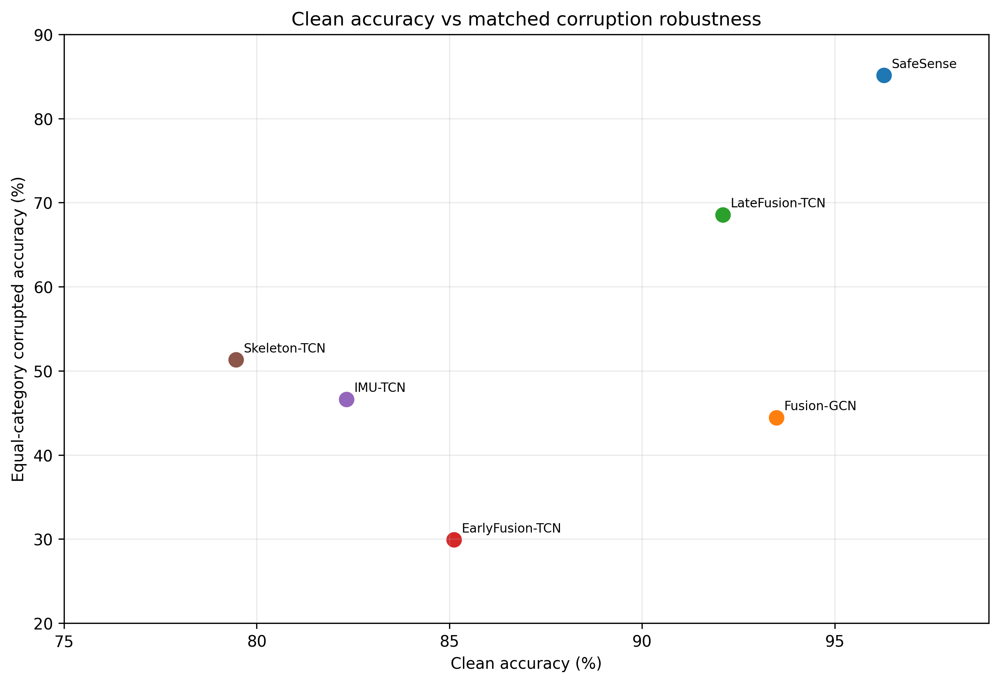

# SafeSense

**Robust and Efficient Skeleton-Inertial Human Activity Recognition Under Sensor Degradation**

SafeSense is a compact multimodal human activity recognition model that classifies one isolated activity sequence using **3D skeleton + inertial (IMU) signals only**. The release focuses on three practical goals: competitive clean recognition, graceful degradation under sensor corruption, and low-cost batch-1 inference.

<p align="center">
  
</p>

## Highlights

- **96.28% clean accuracy / 96.36% macro-F1** on the UTD-MHAD odd/even cross-subject protocol.
- **85.13% equal-category corruption accuracy** across a fixed 25-scenario sensor-degradation suite.
- **0.441M trainable parameters**.
- **1.732 ms median** model-only FP32 batch-1 inference on an NVIDIA Tesla T4 using CUDA Graph replay.
- Exact frozen **seed-22 SWA checkpoint and normalization statistics are included**.
- Public code contains only the final SafeSenseFactorized system: data preparation, training, clean evaluation, corruption evaluation, inference benchmarking, tests, and result summaries.

## Main results

| Model | Clean accuracy | Equal-category corruption accuracy | Parameters |
|---|---:|---:|---:|
| **SafeSense** | **96.28%** | **85.13%** | 440,562 |
| LateFusion-TCN | 92.09% | 68.55% | 90,006 |
| Fusion-GCN | 93.49% | 44.43% | 3,456,631 |
| IMU-TCN | 82.33% | 46.64% | 37,083 |
| Skeleton-TCN | 79.46% | 51.32% | 52,923 |
| EarlyFusion-TCN | 85.12% | 29.91% | 54,075 |

All six rows above are from the project's matched protocol. Published literature comparisons are kept separate because sensor sets, training objectives, and evaluation protocols differ. See [`docs/RESULTS.md`](docs/RESULTS.md).

<p align="center">
  
</p>

## What the model does

For each activity sample, SafeSense receives:

- a 20-joint 3D skeleton sequence;
- a synchronized six-channel inertial sequence;
- temporal validity masks.

After preparation, each sample has 128 time steps. SafeSense constructs:

- **177 skeleton features/frame** = 60 XYZ positions + 60 first differences + 57 bone-vector values;
- **12 IMU features/frame** = 6 prepared sensor channels + 6 first differences.

The skeleton stream is encoded by both a temporal-convolution branch and an explicit human-body graph branch. The IMU has its own temporal encoder. Both are projected to width 96, reduced from 128 to 32 temporal tokens, and fused by two factorized blocks that apply temporal attention followed by modality attention. Mask-aware mean+max pooling produces a 192-D representation and a 27-class head.

See [`docs/ARCHITECTURE.md`](docs/ARCHITECTURE.md) for an end-to-end explanation.

## Repository layout

```text
.
├── README.md
├── LICENSE
├── pyproject.toml
├── requirements.txt
├── configs/utd_mhad.json
├── checkpoints/
│   ├── safesense_seed22_swa.pt
│   ├── safesense_seed22_stats.npz
│   └── README.md
├── src/safesense/
│   ├── model.py          # final SafeSenseFactorized architecture
│   ├── data.py           # UTD-MHAD preparation + feature construction
│   ├── augment.py        # corruption-aware training views
│   ├── training.py       # four-view objective + late SWA
│   ├── corruptions.py    # exact 25-scenario corruption suite
│   ├── evaluation.py     # clean + robustness replay
│   └── efficiency.py     # eager/CUDA-Graph timing helpers
├── scripts/
│   ├── prepare_utd_mhad.py
│   ├── train.py
│   ├── evaluate.py
│   ├── evaluate_robustness.py
│   ├── benchmark.py
│   └── smoke_test.py
├── tests/
├── docs/
├── results/
├── assets/
└── references.bib
```

## Quick start

### 1. Install

The frozen experiment used Python 3.10.17 and PyTorch 2.10.0.

```bash
python3.10 -m venv .venv
source .venv/bin/activate
pip install -U pip
pip install -e .
```

For development/tests:

```bash
pip install -e '.[dev]'
pytest -q
python scripts/smoke_test.py
```

### 2. Obtain UTD-MHAD

The dataset is **not redistributed**. Obtain UTD-MHAD from its official source and extract the Skeleton and Inertial MAT files locally. The preparation code expects files such as:

```text
data/raw/Skeleton/a1_s1_t1_skeleton.mat
data/raw/Inertial/a1_s1_t1_inertial.mat
```

Folder capitalization can vary; the loader searches recursively. RGB and depth are never read by SafeSense.

Prepare the arrays:

```bash
python scripts/prepare_utd_mhad.py \
  --data-dir data/raw \
  --output-dir data/processed
```

Expected audit:

```text
861 paired samples
431 odd-subject training samples: subjects 1,3,5,7
430 even-subject test samples: subjects 2,4,6,8
prepared tensor: [N,1,128,22,3]
```

See [`docs/DATA.md`](docs/DATA.md).

### 3. Evaluate the released checkpoint

```bash
python scripts/evaluate.py \
  --prepared-dir data/processed \
  --checkpoint checkpoints/safesense_seed22_swa.pt \
  --stats checkpoints/safesense_seed22_stats.npz \
  --device cuda
```

Expected headline result:

```text
414 / 430 correct
accuracy   0.9627906976744186
macro-F1   0.96364139833354
```

### 4. Replay the 25-scenario corruption benchmark

```bash
python scripts/evaluate_robustness.py \
  --prepared-dir data/processed \
  --checkpoint checkpoints/safesense_seed22_swa.pt \
  --stats checkpoints/safesense_seed22_stats.npz \
  --device cuda \
  --output outputs/robustness.json
```

Expected aggregate:

```text
equal-category accuracy   0.851298449612403
equal-category macro-F1   0.8480595778854244
```

### 5. Train the final model from scratch

```bash
python scripts/train.py \
  --prepared-dir data/processed \
  --output-dir outputs/seed22-final \
  --device cuda
```

Defaults reproduce the selected recipe:

```text
seed          22
epochs        60
batch size    32
AdamW lr      1e-3
weight decay  1e-4
SWA           epochs 45-60 inclusive
```

For one odd-subject development fold:

```bash
python scripts/train.py \
  --prepared-dir data/processed \
  --output-dir outputs/fold7-seed22 \
  --fold-subject 7 \
  --device cuda
```

See [`docs/TRAINING.md`](docs/TRAINING.md).

### 6. Benchmark inference

Eager model-only timing:

```bash
python scripts/benchmark.py \
  --prepared-dir data/processed \
  --device cuda
```

CUDA Graph timing:

```bash
python scripts/benchmark.py \
  --prepared-dir data/processed \
  --device cuda \
  --cuda-graph
```

The paper measurement uses batch size 1, FP32, 200 warmups, 1000 synchronized iterations, and excludes sensor acquisition, skeleton estimation, preprocessing, and host-to-device transfer.

## Training objective

Each batch produces four views:

```text
clean       0.55 CE
+ temporal  0.15 CE
+ structured 0.15 CE
+ style     0.15 CE
```

The full objective also includes:

- 0.15 modality-expert supervision;
- 0.15 cross-modal alignment;
- 0.10 prediction consistency across altered views.

This corruption-aware learning strategy is part of the final model recipe; it is not an evaluation-only trick.

## Robustness suite

The fixed evaluator contains one clean case and 24 corruptions grouped into five equal-weight categories:

- temporal shifts;
- frame loss;
- Gaussian noise;
- missing modality;
- one composite IMU degradation.

<p align="center">
  
</p>

The corruption definitions are deterministic given the fixed seed and are implemented in [`src/safesense/corruptions.py`](src/safesense/corruptions.py).

## Comparison scope

SafeSense is **not presented as an overall UTD-MHAD accuracy record**. CMC-CMKM and several richer-modality or distillation systems report higher clean values under different training/inference contracts. The strongest evidence for SafeSense is the combination of:

1. competitive skeleton+IMU clean accuracy;
2. substantially stronger matched corruption performance;
3. a compact 0.441M-parameter model;
4. measured matched GPU deployment performance.

See [`docs/RESULTS.md`](docs/RESULTS.md) and [`MODEL_CARD.md`](MODEL_CARD.md).

## Reproducibility status

This public extraction was verified against the internal frozen implementation before release preparation:

- public and internal model parameter counts: **440,562 / 440,562**;
- state-dict key order: identical;
- maximum logit difference on masked test inputs after state transfer: **0.0**;
- maximum returned availability-weight difference: **0.0**;
- frozen checkpoint clean replay: **96.2791% / 96.3641%**;
- frozen checkpoint corruption replay: **85.1298% / 84.8060%**.

See [`docs/REPRODUCIBILITY.md`](docs/REPRODUCIBILITY.md).

## License

SafeSense is released under the **MIT License**. See [`LICENSE`](LICENSE) for details.
