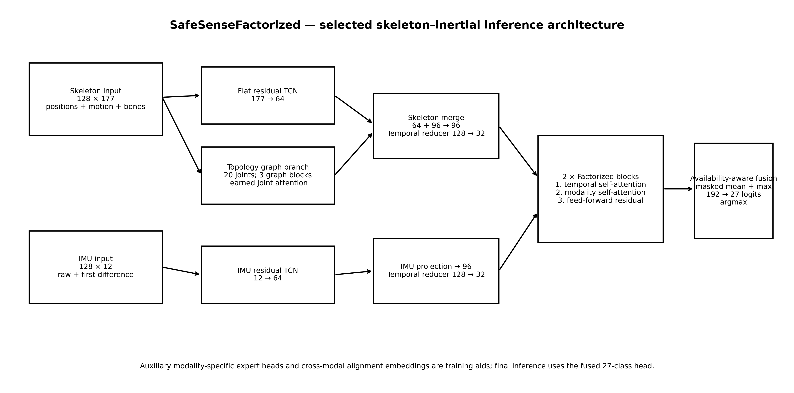

# Architecture

SafeSenseFactorized is a graph-aware dual-stream sequence classifier. It predicts one of 27 UTD-MHAD actions from a prepared skeleton sequence and a synchronized IMU sequence.



## End-to-end path

```text
prepared sample [B,1,128,22,3]
                │
       split modalities
        ┌───────┴────────┐
        │                │
skeleton features      IMU features
 [B,128,177]           [B,128,12]
        │                │
   ┌────┴─────┐          │
   │          │          │
flat TCN   body graph   IMU TCN
  64          96         64
   │          │          │
   └── concat ┘          │
       160               │
        │                │
    project 96       project 96
        │                │
 temporal reducer    temporal reducer
 128 -> 64 -> 32     128 -> 64 -> 32
        └───────┬────────┘
                │
     two factorized fusion blocks
     time attention -> modality attention -> FFN
                │
       availability-aware fusion
                │
       masked mean + max pooling
                │
             192-D
                │
          27-class head
```

## Skeleton flat TCN

The complete 177-D per-frame descriptor is projected to 64 channels and processed by three residual depthwise temporal blocks with dilations 1, 2, and 4. Each block uses depthwise Conv1D, pointwise Conv1D, GroupNorm, GELU, dropout, and a residual connection.

This branch treats the engineered pose/motion/bone descriptor as one global temporal feature vector.

## Skeleton topology branch

Each of the 20 joints receives six values: XYZ position + XYZ first difference. A fixed 20-joint human-body graph includes self-connections and 19 kinematic edges. Three graph blocks combine a joint's own transformed representation with normalized neighbor messages.

A learned scalar attention score weights the 20 joints at each frame. The weighted joint representation then passes through a width-96 temporal TCN.

The topology branch therefore captures both:

- anatomical relationships among joints;
- motion patterns over time.

## Skeleton merge

The 64-channel flat TCN and 96-channel topology branch are concatenated (`64 + 96 = 160`) and projected to the common fusion width of 96.

## IMU branch

The 12-D IMU sequence has its own residual TCN (`12 -> 64`) and a projection to width 96. The streams remain separate through early temporal encoding.

## Temporal reduction

Two stride-2 depthwise-separable convolutional reducers compress each 128-step stream:

```text
128 -> 64 -> 32 tokens
```

Masks are max-pooled in parallel. Attention therefore operates over only 32 tokens per modality.

## Factorized time/modality attention

The two streams are stacked as `[B, 2, 32, 96]` and passed through two identical blocks.

Each block performs:

1. **temporal self-attention** independently inside each modality;
2. **modality self-attention** between skeleton and IMU at each time position;
3. a feed-forward residual transform.

Mask-safe attention prevents unavailable tokens from acting as valid evidence.

Factorized time/modality attention itself is established prior art; SafeSense does not claim to invent it. The contribution is the complete compact graph-aware skeleton/IMU system and its robustness/deployment treatment.

## Pooling and classification

At each reduced time step, valid modality tokens are averaged. The fused sequence is summarized by:

```text
masked mean: 96
masked max:  96
----------------
final:       192
```

`LayerNorm(192) -> Linear(192,27)` produces class logits.

## Auxiliary training heads

The model also contains skeleton-only and IMU-only expert heads plus alignment embeddings. They provide auxiliary training supervision; the final prediction is **not** an ensemble of three classifiers. Inference uses the main 27-class logits.

## Parameter count

The exact default model has **440,562 trainable parameters**. `tests/test_model.py` and `scripts/smoke_test.py` enforce this value.
