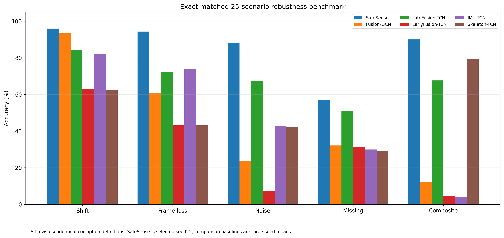

# Evaluation

## Clean cross-subject evaluation

The final model is trained on odd subjects `1,3,5,7` and evaluated on even subjects `2,4,6,8`.

Metrics:

- accuracy;
- macro-F1;
- per-class F1;
- confusion matrix.

The released checkpoint gives:

```text
414 / 430 correct
accuracy  = 96.2791%
macro-F1  = 96.3641%
```

## Fixed 25-scenario corruption suite

The evaluator contains one clean scenario and 24 corrupted scenarios.

### Temporal shift

For skeleton and IMU separately:

```text
-4, -2, +2, +4 frames
```

Shifts are zero padded, never circular.

### Frame loss

For each modality separately:

```text
10%, 30%, 50%
```

Valid frames are removed with a deterministic NumPy RNG seeded by the benchmark seed.

### Noise

For each modality separately:

```text
0.1, 0.3, 0.5 × training-derived raw standard deviation
```

Noise scales are derived only from the odd-subject training partition.

### Missing modality

```text
missing skeleton
missing IMU
missing both
```

### Composite

One fixed IMU corruption:

```text
+4-frame shift + 30% frame loss + 0.3 noise
```

## Headline robustness aggregation

The 24 corruptions are grouped into five categories:

```text
shift
frame_loss
noise
missing
composite
```

First average within each category, then average the five category means equally. This prevents categories containing more severity settings from receiving greater implicit weight.

SafeSense category accuracies:

| Category | Accuracy |
|---|---:|
| Shift | 95.96% |
| Frame loss | 94.34% |
| Noise | 88.29% |
| Missing | 57.05% |
| Composite | 90.00% |
| **Equal-category mean** | **85.13%** |



## Statistical interpretation

SafeSense clean accuracy has a Wilson 95% interval of **94.04%-97.70%** around the observed 414/430 result.

Against concrete Fusion-GCN final-weight runs on the same 430 samples:

| Seed | SafeSense advantage | Paired bootstrap 95% CI | Exact McNemar p |
|---:|---:|---:|---:|
| 11 | +3.49 pp | +0.93 to +6.05 | 0.0107 |
| 22 | +1.86 pp | -0.47 to +4.19 | 0.1686 |
| 33 | +3.02 pp | +0.47 to +5.58 | 0.0351 |

Do not turn this into a blanket statement that every clean baseline difference is statistically significant. Robustness differences are larger and have positive paired-bootstrap intervals against every seed of every matched standard baseline.

## Latency protocol

Paper timing scope:

```text
NVIDIA Tesla T4
FP32
batch size 1
200 warmups
1000 synchronized iterations
model forward only
```

The CUDA Graph path includes device-to-device copies into static capture buffers. It excludes skeleton estimation, sensor I/O, preprocessing, and host-to-device transfer.

Reported SafeSense CUDA Graph result:

```text
median 1.732 ms
p95    1.740 ms
```

10,750 eager-vs-graph predictions were checked across all 25 scenarios with **0 prediction mismatches**.
