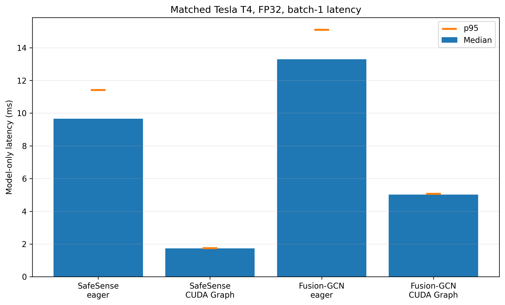

# Results and comparison scope

## Matched project benchmark

The strongest quantitative comparison evaluates six systems using the same UTD-MHAD split and exact corruption suite.

| Model | Clean acc. | Clean macro-F1 | Corruption acc. | Corruption macro-F1 | Params |
|---|---:|---:|---:|---:|---:|
| **SafeSense** | **96.28%** | **96.36%** | **85.13%** | **84.81%** | 440,562 |
| Fusion-GCN | 93.49% | 93.46% | 44.43% | 42.06% | 3,456,631 |
| LateFusion-TCN | 92.09% | 91.95% | 68.55% | 66.92% | 90,006 |
| EarlyFusion-TCN | 85.12% | 84.58% | 29.91% | 27.02% | 54,075 |
| IMU-TCN | 82.33% | 82.06% | 46.64% | 45.22% | 37,083 |
| Skeleton-TCN | 79.46% | 78.48% | 51.32% | 49.27% | 52,923 |

LateFusion-TCN is the strongest simple corruption control. SafeSense exceeds its three-seed mean by **+4.19 percentage points clean** and **+16.58 points corruption accuracy**.

The simple TCNs are smaller than SafeSense; therefore the claim is not "smallest model." The stronger claim is that SafeSense has a substantially better clean/robustness operating point while remaining sub-million-parameter.

## Fusion-GCN deployment comparison

| System | Parameters | Median | p95 |
|---|---:|---:|---:|
| **SafeSense CUDA Graph** | **440,562** | **1.732 ms** | **1.740 ms** |
| Fusion-GCN CUDA Graph | 3,456,631 | 5.017 ms | 5.065 ms |

Under the matched T4 CUDA-Graph protocol, SafeSense is approximately **2.90× faster** by median latency and has **87.25% fewer parameters**.

## Closest published clean comparisons

Published values are not automatically matched because training objectives and sensing contracts differ.

| Model | UTD-MHAD setting | Reported accuracy | Role |
|---|---|---:|---|
| Residual Conv + Gram (2025) | skeleton + IMU, odd/even | 93.50% | direct recent |
| Fusion-GCN (2021) | skeleton + IMU, cross-subject | 94.42% | direct |
| **SafeSense** | skeleton + IMU, odd/even | **96.28%** | this work |
| CMC-CMKM (2022) | skeleton + IMU, self-supervised + linear evaluation | 97.67% | close, different objective |

SafeSense is therefore **not claimed as the highest published skeleton+IMU UTD-MHAD accuracy**.

Broader systems such as MuMu, XTinyHAR, UCFFormer, MAWKDN, and richer RGB/depth systems use different modalities, teachers, or protocols. Their values are literature context, not matched deltas.

## What the results support

The defensible paper conclusion is:

> SafeSense combines competitive clean skeleton-inertial recognition with substantially stronger degradation tolerance than graph fusion, early fusion, late decision fusion, and unimodal controls under one exact corruption protocol, while using a compact model and a measured prediction-equivalent low-latency deployment path.

## Machine-readable evidence

- `results/final_metrics.json`
- `results/replay_robustness.json`
- `results/matched_models.csv`
- `results/robustness_categories.csv`
- `results/paired_clean_statistics.csv`
- `results/paired_robustness_statistics.csv`
- `results/direct_literature.csv`
